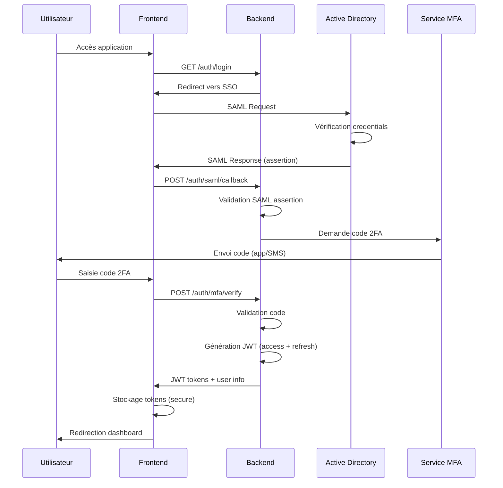

# Architecture Technique - Plateforme DispoDialyse

**Version:** 1.0  
**Date:** 2025-12-10  
**Statut:** Document d'architecture initial

---

## Table des Matières

1. [Vue d'Ensemble](#1-vue-densemble)
2. [Stack Technologique](#2-stack-technologique)
3. [Architecture Globale](#3-architecture-globale)
4. [Architecture de Sécurité](#4-architecture-de-sécurité)
5. [Schéma de Base de Données](#5-schéma-de-base-de-données)
6. [Architecture des Modules](#6-architecture-des-modules)
7. [Stratégies Techniques Critiques](#7-stratégies-techniques-critiques)
8. [Infrastructure et Déploiement](#8-infrastructure-et-déploiement)
9. [Plan d'Implémentation](#9-plan-dimplémentation)
10. [Considérations de Conformité](#10-considérations-de-conformité)

---

## 1. Vue d'Ensemble

### 1.1 Contexte du Projet

DispoDialyse est une plateforme web interne sécurisée destinée à la gestion opérationnelle d'un service de dialyse hospitalier. Elle remplace des processus manuels (plannings muraux, annuaires papier, fiches manuscrites) par une solution numérique centralisée et conforme aux exigences réglementaires du secteur santé.

### 1.2 Contraintes Techniques Identifiées

**Contraintes Réglementaires:**
- Conformité RGPD stricte
- Hébergement données de santé (HDS)
- Audit trail complet et immuable
- Chiffrement TLS 1.3 (transit) et AES-256 (repos)
- Accessibilité WCAG 2.1 niveau AA

**Contraintes de Performance:**
- Temps de chargement < 2 secondes
- Disponibilité > 99.9% (8.76h downtime/an max)
- Support 100 utilisateurs concurrents
- Réactivité temps réel pour planning

**Contraintes Opérationnelles:**
- Intégration SSO avec Active Directory existant
- Support multi-device (desktop, tablette, mobile)
- Authentification 2FA/MFA obligatoire
- Système RBAC avec 8 rôles définis

### 1.3 Périmètre Technique

**Modules Fonctionnels:**
1. Gestion planning salles de dialyse (cœur système)
2. Annuaire personnel détaillé
3. Transmission d'informations patients (avec formulaires et alertes)
4. Planning de garde et d'astérisque
5. Référentiel documentaire
6. Messagerie interne sécurisée

**Volumétrie:**
- ~100 utilisateurs actifs simultanés
- 10-15 salles de dialyse
- ~1000 utilisateurs totaux (personnel)
- Scalabilité prévue jusqu'à 5000+ utilisateurs

---

## 2. Stack Technologique

### 2.1 Frontend

#### 2.1.1 Framework Principal: **React 18+**

**Justifications:**
- **Maturité et stabilité**: React est éprouvé dans le domaine médical (utilisé par des plateformes comme Epic MyChart)
- **Écosystème riche**: Nombreuses bibliothèques de composants accessibles (React Aria, Radix UI)
- **Performance**: Virtual DOM et React 18 concurrent features pour UI réactive
- **Accessibilité**: Excellent support ARIA et outils de test d'accessibilité
- **Communauté**: Large communauté, documentation extensive, ressources de formation
- **TypeScript**: Support first-class pour typage fort et réduction d'erreurs

**Technologies Complémentaires:**
- **TypeScript 5+**: Typage strict pour sécurité et maintenabilité
- **Vite**: Build tool moderne et rapide (HMR ultra-rapide)
- **React Router v6**: Routing avec code splitting automatique
- **TanStack Query (React Query)**: Gestion état serveur, caching, synchronisation
- **Zustand**: State management léger pour état global client
- **React Hook Form**: Gestion formulaires performante avec validation
- **Zod**: Schéma validation type-safe
- **Tailwind CSS**: Styling utilitaire avec design system custom
- **Shadcn/ui**: Composants accessibles et customisables
- **date-fns**: Manipulation dates (alternative légère à moment.js)

**PWA (Progressive Web App):**
- **Workbox**: Service workers pour cache et offline
- **Web Push API**: Notifications push natives
- **IndexedDB**: Stockage local pour données offline

#### 2.1.2 Bibliothèques Spécialisées

**Planning et Calendrier:**
- **FullCalendar**: Composant calendrier riche avec drag-and-drop
- **React Big Calendar**: Alternative légère et flexible
- **DnD Kit**: Drag and drop accessible

**Visualisation et Tableaux de Bord:**
- **Recharts**: Graphiques React natifs et accessibles
- **TanStack Table**: Tables complexes avec virtualisation
- **React Virtuoso**: Virtualisation listes longues

**Messagerie Temps Réel:**
- **Socket.io-client**: WebSocket client
- **React Markdown**: Rendu markdown dans messages

**Recherche:**
- **Fuse.js**: Recherche fuzzy côté client
- **React Select**: Composant select avec recherche

### 2.2 Backend

#### 2.2.1 Framework Principal: **Node.js avec NestJS**

**Justifications:**
- **Architecture structurée**: Framework opiné avec patterns enterprise (modules, DI, guards)
- **TypeScript natif**: Cohérence avec frontend, réduction erreurs
- **Scalabilité**: Architecture modulaire facilitant microservices si nécessaire
- **Sécurité**: Guards, interceptors, pipes pour validation et sécurisation
- **Documentation**: Auto-génération Swagger/OpenAPI
- **Testing**: Framework de test intégré (Jest)
- **Performance**: Node.js avec optimisations possibles (clustering, caching)
- **Écosystème**: Compatible avec toutes bibliothèques Node.js

**Alternative considérée mais non retenue:**
- **FastAPI (Python)**: Excellent mais cohérence TypeScript préférée
- **Spring Boot (Java)**: Très robuste mais overhead plus important

**Technologies Complémentaires:**
- **Express**: Moteur HTTP sous-jacent (via NestJS)
- **Passport.js**: Authentification (stratégies LDAP, SAML, JWT)
- **Helmet**: Sécurité headers HTTP
- **bcrypt/Argon2**: Hachage mots de passe
- **class-validator/class-transformer**: Validation DTOs
- **TypeORM**: ORM pour PostgreSQL
- **Bull**: Queue management pour tâches asynchrones
- **Winston**: Logging structuré
- **Joi**: Validation configuration

#### 2.2.2 APIs et Protocoles

**REST API:**
- **OpenAPI 3.0**: Spécification API
- **Swagger UI**: Documentation interactive
- **Rate Limiting**: Protection contre abus (express-rate-limit)

**WebSocket:**
- **Socket.io**: Temps réel bidirectionnel
- **Rooms**: Isolation par salle/équipe
- **Redis Adapter**: Scalabilité multi-instances

**Server-Sent Events (SSE):**
- Alternative WebSocket pour notifications unidirectionnelles
- Reconnexion automatique

### 2.3 Base de Données

#### 2.3.1 Base de Données Principale: **PostgreSQL 15+**

**Justifications:**
- **Fiabilité**: Base éprouvée dans le secteur médical
- **ACID**: Transactions complètes pour intégrité données
- **JSON Support**: Colonnes JSONB pour flexibilité
- **Full-Text Search**: Recherche native performante
- **Partitionnement**: Support natif pour scalabilité
- **Row-Level Security**: Sécurité granulaire au niveau ligne
- **Extensions**: PostGIS (géolocalisation), pg_cron (tâches planifiées)
- **Réplication**: Master-slave pour haute disponibilité
- **Open Source**: Pas de coûts de licence

**Configuration:**
- **Réplication streaming**: 1 master + 1+ replicas lecture
- **Connection Pooling**: PgBouncer pour optimisation
- **Backup**: WAL archiving + snapshots quotidiens

#### 2.3.2 Cache: **Redis 7+**

**Justifications:**
- **Performance**: In-memory, latence microseconde
- **Structures de données riches**: Strings, hashes, sets, sorted sets, streams
- **Pub/Sub**: Communication temps réel entre instances
- **Persistance**: RDB + AOF pour durabilité
- **Clustering**: Scalabilité horizontale

**Usages:**
- Session storage
- Cache applicatif (données référentielles)
- Rate limiting
- Queue (Bull)
- Pub/Sub (Socket.io adapter)

#### 2.3.3 Recherche: **Elasticsearch 8+ (Phase 2 optionnelle)**

**Justifications:**
- **Recherche full-text**: Puissante et rapide
- **Analyse textuelle**: Stemming, synonymes, fautes de frappe
- **Agrégations**: Statistiques et analytics
- **Scalabilité**: Distribution horizontale

**Indexés:**
- Annuaire personnel (recherche multi-critères)
- Documentation (full-text)
- Historique transmissions (recherche contextuelle)

**Alternative Phase 1:** PostgreSQL Full-Text Search suffisant initialement

### 2.4 Authentification et Sécurité

**Authentification:**
- **Active Directory/LDAP**: SSO entreprise via Passport LDAP
- **SAML 2.0**: Alternative SSO
- **JWT**: Tokens session (access + refresh)
- **2FA/MFA**: TOTP (Google Authenticator, Authy) via speakeasy

**Autorisation:**
- **RBAC**: Modèle rôles/permissions avec CASL
- **Row-Level Security**: PostgreSQL RLS pour isolation données

**Chiffrement:**
- **Transit**: TLS 1.3 (Let's Encrypt ou cert interne)
- **Repos**: PostgreSQL native encryption (AES-256)
- **Champs sensibles**: crypto-js pour chiffrement additionnel

**Audit:**
- **Audit Trail**: Table dédiée avec trigger PostgreSQL
- **Log immutables**: Append-only avec checksums
- **SIEM compatible**: Logs JSON structurés (ELK stack possible)

### 2.5 DevOps et Infrastructure

#### 2.5.1 Conteneurisation: **Docker**

**Justifications:**
- **Reproductibilité**: Environnements identiques dev/staging/prod
- **Isolation**: Dépendances encapsulées
- **Portabilité**: Déploiement flexible (cloud HDS, on-premise)

**Images:**
- Frontend: Node Alpine + Nginx
- Backend: Node Alpine
- PostgreSQL: Official image
- Redis: Official image
- Nginx: Reverse proxy et load balancer

#### 2.5.2 Orchestration: **Docker Compose (Dev) + Azure Container Instances ou AWS ECS (Prod)**

**Justifications:**
- **Simplicité**: Docker Compose pour dev/test
- **Cloud HDS**: Azure/AWS certifiés pour production
- **Managed Services**: Réduction complexité opérationnelle
- **Auto-scaling**: Scaling automatique selon charge
- **Monitoring intégré**: CloudWatch/Azure Monitor

**Alternative K8s**: Overkill pour 100 utilisateurs, mais architecture prête si besoin futur

#### 2.5.3 CI/CD: **GitHub Actions**

**Justifications:**
- **Intégration Git**: Workflow natif avec repository
- **Gratuit**: Pour projets privés (limite généreuse)
- **Flexibilité**: Runners custom possibles
- **Marketplace**: Actions pré-construites

**Pipeline:**
1. **Lint**: ESLint, Prettier
2. **Tests**: Jest (unit), Playwright (E2E)
3. **Security**: npm audit, Snyk, OWASP dependency check
4. **Build**: Docker images
5. **Deploy**: Staging automatique, Production manuel

#### 2.5.4 Monitoring et Observabilité

**Application Performance Monitoring:**
- **Sentry**: Error tracking et performance
- **Prometheus + Grafana**: Métriques système (alternative: Azure Monitor)

**Logs:**
- **Winston**: Backend logging
- **Azure Log Analytics ou CloudWatch**: Agrégation cloud
- **ELK Stack (optionnel)**: Pour analyse avancée on-premise

**Uptime:**
- **UptimeRobot**: Monitoring externe gratuit
- **Healthchecks**: Endpoints /health backend

### 2.6 Tests

**Frontend:**
- **Jest**: Tests unitaires composants
- **React Testing Library**: Tests intégration
- **Playwright**: Tests E2E multi-browsers
- **axe-core**: Tests accessibilité automatisés

**Backend:**
- **Jest**: Tests unitaires et intégration
- **Supertest**: Tests API
- **Test Containers**: PostgreSQL/Redis pour tests intégration

**Objectifs:**
- Coverage > 80%
- Tests critiques (auth, planning, sécurité) > 95%

### 2.7 Récapitulatif Stack

```
Frontend:
├── React 18 + TypeScript
├── Vite (build tool)
├── TanStack Query (data fetching)
├── Zustand (state management)
├── React Router (routing)
├── Tailwind CSS + Shadcn/ui (UI)
├── FullCalendar (planning)
├── Socket.io-client (WebSocket)
└── Workbox (PWA)

Backend:
├── Node.js 20 LTS
├── NestJS (framework)
├── TypeORM (ORM)
├── Passport.js (auth)
├── Socket.io (WebSocket)
├── Bull (queues)
└── Winston (logging)

Données:
├── PostgreSQL 15 (principal)
├── Redis 7 (cache, sessions, queues)
└── Elasticsearch 8 (recherche, phase 2)

Infrastructure:
├── Docker + Docker Compose
├── Azure/AWS (cloud HDS certifié)
├── GitHub Actions (CI/CD)
├── Sentry (monitoring)
└── Let's Encrypt (SSL)
```

---

## 3. Architecture Globale

### 3.1 Style Architectural: **Monolithe Modulaire**

**Justification du choix:**

Pour un MVP de 12 mois avec 100 utilisateurs et une équipe de développement limitée, un **monolithe modulaire** est optimal:

**Avantages:**
- **Simplicité déploiement**: Un seul déploiement vs multiples microservices
- **Performance**: Pas de latence réseau inter-services
- **Transactions**: Transactions ACID simples entre modules
- **Développement**: Moins de complexité infrastructure
- **Débogage**: Traces d'erreurs complètes
- **Coûts**: Infrastructure minimale

**Architecture modulaire préparée pour évolution:**
- Modules découplés via interfaces claires
- Communication inter-modules via événements (EventEmitter)
- APIs internes bien définies
- Migration vers microservices possible si scaling nécessaire (> 1000 utilisateurs concurrents)

### 3.2 Architecture en Couches

```
┌─────────────────────────────────────────────────────────────┐
│                     PRÉSENTATION LAYER                       │
│  ┌──────────────┐  ┌──────────────┐  ┌──────────────┐      │
│  │   Web App    │  │   PWA App    │  │  Mobile Web  │      │
│  │  (Desktop)   │  │  (Offline)   │  │  (Tablette)  │      │
│  └──────────────┘  └──────────────┘  └──────────────┘      │
│           React + TypeScript + Tailwind CSS                  │
└─────────────────────────────────────────────────────────────┘
                              │
                         HTTPS/WSS
                              │
┌─────────────────────────────────────────────────────────────┐
│                      API GATEWAY LAYER                       │
│  ┌──────────────────────────────────────────────────────┐   │
│  │  Nginx Reverse Proxy + Load Balancer                 │   │
│  │  - Rate Limiting                                      │   │
│  │  - SSL Termination                                    │   │
│  │  - Request Routing                                    │   │
│  └──────────────────────────────────────────────────────┘   │
└─────────────────────────────────────────────────────────────┘
                              │
        ┌─────────────────────┴─────────────────────┐
        │                                             │
┌───────▼──────────────────┐              ┌──────────▼─────────┐
│   APPLICATION LAYER      │              │   WEBSOCKET        │
│   (NestJS Backend)       │◄─────────────┤   SERVER           │
│                          │  Event Bus   │   (Socket.io)      │
│  ┌────────────────────┐  │              └────────────────────┘
│  │  Controllers       │  │
│  │  (REST API)        │  │
│  └────────────────────┘  │
│           │              │
│  ┌────────▼───────────┐  │
│  │  Services Layer    │  │
│  │  (Business Logic)  │  │
│  └────────────────────┘  │
│           │              │
│  ┌────────▼───────────┐  │
│  │  Repository Layer  │  │
│  │  (Data Access)     │  │
│  └────────────────────┘  │
└──────────┬───────────────┘
           │
    ┌──────┴───────┐
    │              │
┌───▼────┐   ┌────▼─────┐
│ Redis  │   │PostgreSQL│
│ Cache  │   │ Database │
└────────┘   └──────────┘
```

### 3.3 Pattern Architectural: **Clean Architecture + DDD Tactique**

**Principes appliqués:**

1. **Séparation des préoccupations**: Chaque couche a une responsabilité claire
2. **Dépendances unidirectionnelles**: Les couches internes ignorent les externes
3. **Inversion de dépendances**: Abstractions définies par business logic
4. **Testabilité**: Business logic testable indépendamment de l'infrastructure

**Structure NestJS (Clean Architecture):**

```
src/
├── domain/                    # Couche Domaine (Business Rules)
│   ├── entities/              # Entités métier
│   ├── value-objects/         # Value Objects (immutables)
│   ├── repositories/          # Interfaces repositories (abstractions)
│   └── services/              # Domain services (pure business logic)
│
├── application/               # Couche Application (Use Cases)
│   ├── use-cases/             # Cas d'utilisation métier
│   ├── dto/                   # Data Transfer Objects
│   ├── ports/                 # Interfaces pour infrastructure
│   └── events/                # Domain events
│
├── infrastructure/            # Couche Infrastructure (Détails techniques)
│   ├── database/              # Implémentations repositories
│   │   ├── typeorm/           # TypeORM configuration
│   │   ├── repositories/      # Concrete repositories
│   │   └── migrations/        # DB migrations
│   ├── cache/                 # Redis implementation
│   ├── messaging/             # WebSocket/Queue implementations
│   ├── external/              # Services externes (LDAP, email)
│   └── security/              # Auth, encryption
│
├── presentation/              # Couche Présentation (API)
│   ├── controllers/           # REST controllers
│   ├── websocket/             # WebSocket gateways
│   ├── guards/                # Auth guards
│   ├── interceptors/          # Request/Response interceptors
│   ├── filters/               # Exception filters
│   └── validators/            # Input validation pipes
│
└── shared/                    # Code partagé
    ├── decorators/
    ├── utils/
    └── constants/
```

### 3.4 Communication Inter-Modules

**Stratégie Event-Driven (intra-monolithe):**

```typescript
// Exemple: Module Planning émet événement
this.eventEmitter.emit('planning.session.created', {
  sessionId: '123',
  roomId: 'room-5',
  staffIds: ['user-1', 'user-2'],
  timestamp: new Date()
});

// Module Notification écoute et réagit
@OnEvent('planning.session.created')
handleSessionCreated(payload: SessionCreatedEvent) {
  // Envoyer notifications au staff assigné
  this.notificationService.notifyStaff(payload.staffIds, {
    type: 'SESSION_ASSIGNED',
    sessionId: payload.sessionId
  });
}
```

**Avantages:**
- Découplage modules
- Extensibilité (nouveaux listeners sans modifier émetteurs)
- Traçabilité (logs événements)
- Préparation pour event sourcing futur

---

## 4. Architecture de Sécurité

### 4.1 Modèle de Sécurité Multi-Couches

```
┌──────────────────────────────────────────────────────────────┐
│  COUCHE 1: PÉRIMÈTRE RÉSEAU                                  │
│  - Firewall (NSG Azure/Security Groups AWS)                  │
│  - WAF (Web Application Firewall)                            │
│  - DDoS Protection                                           │
│  - VPN/Private Link pour accès admin                         │
└──────────────────────────────────────────────────────────────┘
                            │
┌──────────────────────────▼───────────────────────────────────┐
│  COUCHE 2: TRANSPORT                                          │
│  - TLS 1.3 obligatoire                                        │
│  - HSTS (HTTP Strict Transport Security)                     │
│  - Certificate Pinning (mobile apps)                         │
└──────────────────────────────────────────────────────────────┘
                            │
┌──────────────────────────▼───────────────────────────────────┐
│  COUCHE 3: AUTHENTIFICATION                                   │
│  - SSO Active Directory (LDAP/SAML)                          │
│  - MFA obligatoire (TOTP)                                     │
│  - JWT avec refresh tokens                                   │
│  - Session timeout (30 min inactivité)                       │
│  - Account lockout après 5 tentatives                        │
└──────────────────────────────────────────────────────────────┘
                            │
┌──────────────────────────▼───────────────────────────────────┐
│  COUCHE 4: AUTORISATION                                       │
│  - RBAC (8 rôles définis)                                     │
│  - Permission granulaire par ressource                        │
│  - Row-Level Security (PostgreSQL RLS)                       │
│  - Principle of Least Privilege                              │
└──────────────────────────────────────────────────────────────┘
                            │
┌──────────────────────────▼───────────────────────────────────┐
│  COUCHE 5: APPLICATION                                        │
│  - Input validation (Zod, class-validator)                    │
│  - Output encoding                                            │
│  - CSRF protection                                            │
│  - XSS protection (CSP headers)                               │
│  - SQL Injection prevention (parameterized queries)           │
│  - Rate limiting (100 req/min par user)                      │
└──────────────────────────────────────────────────────────────┘
                            │
┌──────────────────────────▼───────────────────────────────────┐
│  COUCHE 6: DONNÉES                                            │
│  - Encryption at rest (AES-256)                               │
│  - Sensitive fields encryption (PII)                          │
│  - Audit logging complet                                      │
│  - Data masking (logs, exports)                               │
│  - Backup encryption                                          │
└──────────────────────────────────────────────────────────────┘
```

### 4.2 Flux d'Authentification SSO + MFA



### 4.3 Modèle RBAC Détaillé

**8 Rôles Système:**

```typescript
enum Role {
  SUPER_ADMIN = 'super_admin',           // Administration système complète
  ADMIN_FONCTIONNEL = 'admin_fonctionnel', // Gestion contenu et configuration
  CADRE_SANTE = 'cadre_sante',           // Gestion planning et équipes
  MEDECIN = 'medecin',                   // Médecin néphrologue
  INFIRMIER = 'infirmier',               // IDE
  AIDE_SOIGNANT = 'aide_soignant',       // AS
  SECRETARIAT = 'secretariat',           // Secrétariat médical
  TECHNICIEN = 'technicien'              // Technicien biomédical
}

// Permissions granulaires
enum Permission {
  // Planning
  'planning:read',
  'planning:create',
  'planning:update',
  'planning:delete',
  'planning:validate',
  
  // Transmission
  'transmission:read',
  'transmission:write',
  'transmission:delete',
  
  // Annuaire
  'directory:read',
